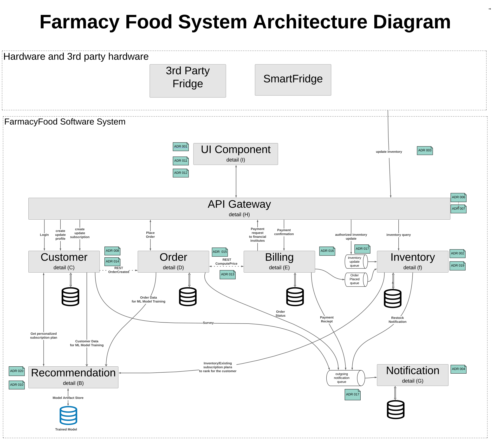

# [High Level Architecture](../../../README.md)

At a high level, SelfDrivenTeam proposes micro-services based approach, with 8 clearly deliniated domains. Each domain is scaleable individually to handle increases in load, and the overall architecture is shardable to provide for geographic growth, isolation, and additional scalability if needed.

The [API Gateway](/doc/arc/components/api_gateway.md) provides a single entry point to the system and is responsible for initial Authentication and routing requests to the appropriate domain. When needed for scale and latency, the API Gateway will also be responsible for sharding traffic based on location. Finally, the [API Gateway](/doc/arc/components/api_gateway.md) allows Farmacy Food to redirect or replicate a portion of the traffic to another shared for A/B testing and/or disaster recovery.

The [Customer Domain](/doc/arc/components/customer_domain.md) is responsible for managing and protecting customer data, including Personally Identifiable Information such as address and financial information, as well as subscription and survey/preference information. In keeping with Farmacy Food's vision of food as medicine and providing customized meals based on customer preferences and, eventually, medical information, the [Customer Domain](/doc/arc/components/customer_domain.md) is also responsible ensuring HIPAA compliance and aggregating/anonymizing customer data for analysis and planning.

The [Order Domain](/doc/arc/components/order_domain.md) is Farmacy Food's customer's most direct contact point, and as such **must** be highly reliable, low latency, burstable as meal times are clustered in any given geographic location. The [Order Domain](/doc/arc/components/order_domain.md) also requires close communication with the [Inventory Domain](/doc/arc/components/inventory_domain.md) to ensure that all orders are fulfillable.

The [Inventory Domain](/doc/arc/components/inventory_domain.md) maintains the source of truth of inventory for all of distributed SmartFridge devices and Kiosks. Because it is the source of truth it must be durable, and any information pushed to it must be handled in order and exactly once. While the [Inventory Domain](/doc/arc/components/inventory_domain.md) is the source of distributed truth, it is recognized that it may occasionally become incorrect, so it must be updateable by personel in the field if needed.

Because there are multiple ways to initiate a financial transaction (wed, mobile, SmartFridge, etc) the [Billing Domain](/doc/arc/components/billing_domain.md) centralizes and isolates the interactions with banks and clearing houses. This allows the domain to have additional security and authorization functionality to protect both Farmacy Food and its customers.

Similarly, the [Notification Engine](/doc/arc/components/notification_engine.md) provides a single entrypoint for sending notification by various mechanisms (SMS, Email, Push Notifications, etc). By centralizing this functionality we reduce duplication of effort and provide Farmacy Food with a since place to manage their communications. This make is easier for them to maintain a consistent look and feel and manage brand awareness.

At this time, to minimize required effort **and** to maximize reach, we propose the [UI Component](/doc/arc/components/ui_component.md) be built as a highly responsive website that can automatically flow between the various screen sizes and orientations used in the mobile, desktop, and Point-Of-Sale devices. This approach allows quick initial time to market, and can be updated with OS specific applications as needed/desired in the future.

Finally, Farmacy Food's special sauce, the [Recomendation Engine](/doc/arc/components/recommendation_engine.md), is responsible for not only providing automated recommendations for individuals based on their preferences and goals, but also can be extended to include relevant medical information as well. The [Recomendation Engine](/doc/arc/components/recommendation_engine.md) can also be used with aggregated/anonymized data to help guide Fancy Food nutritionists in selecting new foods to be added to the menu as customer requirements and desires change.
